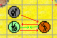
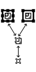
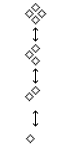
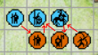
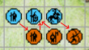
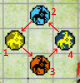
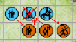
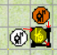
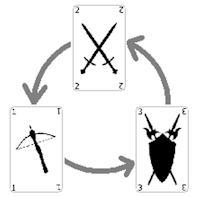

# Правила для одновременной игры в ВС с сохранением [классических правил](https://wtihe.itch.io/vsgame)

## ВСТУПЛЕНИЕ

Игра, к которой я постараюсь написать здесь правила, представляет собой
сказочный мир фэнтэзи, в котором Вам предстоит управлять государством и
добиваться своих целей: строить города и открывать рудники, наводить мосты и
основывать крепости; осваивать новые земли и плавать к далёким островам,
бороться с драконами и недругами, пытающимися завоевать Вашу страну,
заключать и расторгать мир между державами – быть Правителем,
Полководцем, стремясь к мировому господству или Бродягой скитаться по свету!
Игра происходит на карте с морями, материками и островами. Стремясь к господству,
игроки возводят дома лорда, приносящие доход с земель, или захватывают их у
других игроков. Для строительства и захвата у игроков есть войска, которые
нанимаются в постройках. Одно войско – Личное – игроку выдаётся при
вступлении в игру. На строительство и найм расходуются денежные средства, которые игрок получает в виде дохода от земель и рудников.

### Для игры в ВС Вам потребуется

- карта игрового мира, разделённая на клеточки, каждая из которых может быть одной из шести местностей: поле, лес, пустыня, горы, прибрежное море, открытое море.
  По суше могут протекать реки. На карте обозначаются клетки, на которых можно открывать рудники. Также необходимо поделить карту на земли (провинции) с указанием дохода с них в монетах.
- монеты разного достоинства, для финансовых операций в игре.
- фигурки, фишки обозначающие войска и корабли.
- плоские карточки, размером в 1 клетку, с символическим изображением
  строений.
- карточки для сражений с символикой приказов отрядам.
- желающие играть, и время для игры.
- кубик d6.

### Цель игрока

захватить половину мира или убедить владельцев 2/3 земель, что он то точно сможет сделать (по
договорённости игроков, цель может быть и иной).

## 0. ПЕРЕД НАЧАЛОМ ИГРЫ

### 0.1. Уточнение правил.

Прежде всего, следует договориться о любых дополнениях и изменениях к правилам, если играющие пожелают их внести.

### 0.2. Назначить Ведущего

Ведущий необходим для записи летописи, выдачи дохода и решения спорных ситуаций, если в этом есть необходимость. Эти обязанности можно также разделить между игроками.

### 0.3. Регламент

Затем, требуется согласовать регламент проведения игры: карту, способ приёма в игру, время на ход, условия замены игрока, условия окончания игры, дополнения и изменения к правилам, и прочее. Пример регламента в приложении.

## 1. ОПРЕДЕЛЕНИЯ.

- Альянс - взаимодействие между двумя игроками, при котором они дали друг другу все разрешения и по сути ходят как один игрок.
- Драконья гора - клетка со знаком дракона.
- Казна - деньги, которыми располагает правитель на текущий момент.
- Полководец - игрок, владеющий только войсками.
- Постройка - Дома Лорда и Крепости
- Правитель - игрок, владеющий землями.
- Совместный бой - бой является совместным для той стороны, в которой принимают участие несколько игроков.
- Строение - постройка или рудник
- Фаза хода - этап игры, в который игроки могут совершать только определенные действия
- Юнит - войско или строение - любая фишка на карте.

## 2. ХОД ИГРЫ.

### 2.0. Каждый ход игры делится на 4 последовательные фазы:

- Расчет казны (техническая фаза)
- Фаза перемещения, во время которой можно передвигают войска
- Фаза активных действий, в которую совершаются активные действия и объявления боев
- Фаза проведения боев, во время которой игроки присылают расстановки для сформированных боев

### 2.1. Расчет казны.

Игроки никак не задействованы в этой фазе, это техническая фаза, в которой Ведущий актуализирует данные по казне игроков.

Перед началом каждого хода происходит перерасчет казны в следующей последовательности:

- Если за предыдущий год игрок, по итогу различных действий(грабеж, роспуск в постройке и т.д), должен был получить деньги, то они вносятся в казну.

- Из казны игроков изымаются все деньги сверх оговорённого предела. (По умолчанию предел казны 75 монет)

- Игрокам начисляется в казну доход, в соответствии с выставленными строениями за вычетом расходов на содержание армий и строений. Если доход отрицательный, то он он изымается из казны. При отрицательной казне войскам игрока недоступны никакие действия в фазу активных действий кроме роспуска, а его строениям - понижения.

### 2.2. Фаза перемещений.

В фазу перемещений игрок может передвинуть любые свои [активные](#4.) войска, а также осуществить посадку и высадку с корабля.

### 2.3. Фаза активных действий.

Игрок может отдать приказы действий всем своим [активным](#4.) войскам и строениям.

Каждое войско/строение может получить только один приказ.

Все действия игроков в фазу активных действий и их строений выполняются одновременно и, в случае конфликта, все конфликтные действия не будут выполнены.

Игрок должен учитывать расход денег в казне. Если по совокупности приказов расходы казны будут превышены - ни одно из платных действий выполнено не будет.

Приказы одного игрока также не должны конфликтовать друг с другом - нельзя отдать приказы на строительство двух построек ближе 3х клеток друг другу, 2 башень на земле и прочее. Такие приказы также не будут приняты.

Результат действий будет получен только по окончании фазы проведения боев. Если действие было заблокировано другим действием, то его результат не будет получен, а деньги, выделенные на приказ возвращены в казну.

### 2.4. Фаза проведения боев.

В фазу проведения боев, завершаются бои, сформированные в предыдущую фазу и выставляются все результаты действий.

### 2.5. Окончание хода.

После того, как все игроки совершили действия их результаты выставлены на карту и отражены в летописи, ход завершается и начинается следующий.

## 3. ИГРОКИ

### 3.0. Типы игроков

Игроки могут быть трёх условных типов.

- ПРАВИТЕЛЬ – игрок, владеющий землями.
- ПОЛКОВОДЕЦ – игрок без земель.
- БРОДЯГА – все параметры игрока, личного войска
  и особенностей государства по договорённости (со
  всеми другими игроками). Возможно всё (например,
  Кулг-На-Гасш: сила 3+, ходит 1 раз в 2 года на 2 клетки без штрафа за переход
  с местности на местность, всегда бьётся с драконом на равных).

### 3.1. Отношения между игроками

В процессе игры приказы юнитам одного игрока могут вступать в противоречие или конфликт с приказами юнитам другого игрока. Обычно, это нормально, но иногда игроки договариваются между собой, чтобы разблокировать какое то действие одного или обоих игроков.

Политические отношения между игроками могут находится в 2х состояниях: нейтралитет и альянс.
В случае нейтралитета игрокам нужно будет ежегодно получать разрешения на действия, блокируемые другим игроком. В случае альянса, считается что все разрешения даны по умолчанию. Пара игроков находится в альянсе если они оба об этом заявили. Альянс считается расторгнутым если любой из игроков выйдет из него, либо совершит нападение на второго игрока.

<b>Примечание: Изначально все игроки нейтральны друг к другу.</b>

### 3.2. Разрешения

Выдача разрешения не является действием и всегда вступает в силу с начала той фазы в которую дано, вне зависимости от того, каким оно является в очереди приказов.

Разрешения должны указывать игрока, которому дается разрешение и объекты которые с этим разрешением связаны (если второе не выполнено, то считается что разрешение дано всем объектам игроков)

Пример1: Войску Х игрока А разрешено пройти мимо моего войска Y - войско Х, в этом случае, может пройти мимо войска Y без остановки
Пример2: Войску Х игрока А разрешено пройти мимо всех моих войск - войско Х, в этом случае, может пройти мимо любых войск игрока без остановки

<i>Примечание: при заключении Альянса данные разрешения действуют бессрочно на все юниты</i>

### Возможные разрешения:

#### 3.2.1. На проход мимо войска

#### 3.2.2. На проход в или через строение

#### 3.2.3. На посадку на корабль

#### 3.2.4. На строительство около войска

#### 3.2.5. На присоединение войска или строения

#### 3.2.5. На сдачу войска ЛВ

#### 3.2.7. На преимущество при атаке войска из крепости

#### 3.2.8. На найм в крепости

#### 3.2.9. На совместное проведение боя

При указании о совместном проведении боя или заключении Альянса, игроки должны делегировать одному из Игроков право на отдачу приказов войскам в случае совместного боя.

<i>Примечание: Если игроки не в Альянсе, то данное разрешение должно быть получено от обоих сторон.</i>

### 3.3. Действия Игрока (доступно в любую фазу).

#### 3.3.1 Выдача разрешения другому игроку.

Игрок может выдать разрешение другому игроку (см. [3.2. Разрешения](#3.2))

#### 3.3.2 Заключение и разрыв Альянса

Игрок может объявить Альянс с другим игроком. Если в эту же фазу этого хода другой игрок также пришлет объявление об Альянсе, то он считается заключенным.
Игрок может разорвать существующий Альянс с игроком в одностороннем порядке.

#### 3.3.3 Пересылка денег

Деньги можно пересылать другому игроку в любую фазу и будут доступны в следующей фазе. За пересылку взимается налог в размере 1/5 от пересылаемой суммы (округление в большую сторону).
<i>Примечание: предполагается, что пересылка осуществляется в фазу перемещений, когда деньги не используются.</i>

#### 3.3.4 Приход в игру

Начинать игру можно правителем, полководцем или бродягой.
Начиная со второго года игры, новый игрок может войти в игру только полководцем или бродягой.
Для прихода в игру правителем игрок получает незанятую землю в соответствии с регламентом. На этой земле он устанавливает дом лорда. В этом доме лорда выставляется личное войско нового правителя. На постройку дома лорда и выставление личного войска за стоимость найма у правителя есть 200 монет.
Всё, что останется после выбора – остаётся в казне к первому году/туру игры. (По умолчанию стандарт: замок, рыцари и 50 монет в казне).

При вхождении в игру полководцем,

- игрок может выбрать любое [нейтральное](#4.1.1) войско на карте и сделать его своим личным.
- любой правитель вправе передать новому игроку под управление любое своё войско (кроме личного), чтобы дать ему возможность вступить в игру полководцем.

Войско полководца неактивно в течение следующего года.

Бродяга заявляется и, если за год/тур никто не возразит, приходит в игру.

#### 3.3.5. Выход из игры

Все юниты игрока, выходящего из игры, становятся нейтральными. Казна обнуляется.
Вышедший игрок сможет вернуться спустя год после выхода.
<i>Замечание: Государство игрока, выходящего из игры, может взять под полное
управление новый игрок (наследник), если таковой найдётся до начала следующего игрового года. Если претендентов на трон несколько, то спор между ними решается
полюбовно (раздел страны) или турниром (всё победителю). В этом случае, все ставшие нейтральными юниты переходят в управление к новому игроку(игрокам)</i>

#### 3.3.6. Назначение Личного войска 

Если у игрока нет [Личного войска](#5.), он может назначить личным любое своё войско.
Войско, назначаемое личным, становится [неактивным](#4.) до следующего года.

#### 3.3.7. Назначение Столицы 

Если у правителя нет [Столицы](#Столица), он должен назначить Столицей любой свой ДЛ. Выбранный ДЛ становится столицей со следующего года.

Если он этого не сделает, то столица будет назначена случайным образом в конце года.

## 4. ВОЙСКА

Войска это все объекты, передвигаемые по карте. На одной клетке может быть не более одного войска (за исключением сухопутного войска, посаженного на корабль), при этом войска могут находиться в строениях.

- войско может лишиться активности на текущий год под воздействием магии или других игровых обстоятельств. В этом случае ему нельзя отдать никакие приказы в фазу передвижений или активных действий.

### 4.1. Особенности войск

### 4.1.1 Нейтральные войска

Войска либо принадлежат одному из игроков и управляются ими, либо нейтральны.
Любой отданный приказ войску, ставшим нейтральным, не будет выполнен.

- Нейтральные войска могут [появляться](#4.1.1.2), а также исчезать случайным образом с карты (в начале года с 5% шансом). Проверка на появление/исчезновение нейтралов происходит в начале каждого года.
- Нейтральные войска/строения всегда [нападают](#4.3.1) на войска/строения игрока, находящиеся на тойже клетке.
- Нейтральные войска могут случайным образом [нападать](#4.3.1) на войска и строения других игроков(не нейтралов), со следующего года после того, как стали нейтральными.
  С вероятностью 1/8 выбирается соседняя клетка, если там стоит юнит игрока, то на него производится нападение.

#### 4.1.1.1 Дракон и драконья гора

- Каждая клетка со знаком дракона является драконьей горой.
- Под каждой из них расположен спящий дракон и неоткрытый мифриловый рудник.
- Любое войско, кроме мага, вставшее на эту клетку подвергнется атаке со стороны дракона.
- Маги могут ходить через гору беспрепятственно.
- Маги могут также попробовать приручить дракона.
- Прирученный дракон может по разным причинам освободиться от контроля. Тогда он полетит домой к своей горе вначале по горизонтали или вертикали до ближайшей диагонали, а потом по ней, либо если находится на равном расстоянии от двух
  диагоналей (соответственно на горизонтали или вертикали координат горы), то летит по этой горизонтали или вертикали.
- Освобожденный дракон начинает ходить со следующего хода после своего освобождения по следующему алгоритму:

1. Дракон сдвигается на одну клетку по пути.
2. Если рядом с драконом стоит войско или строение, то оно будет атаковано (если несколько, то одно из них случайным образом).
3. Если рядом никого нет, то повторить пп.1-2, пока не закончатся передвижения.
4. Достигнув своего обиталища, дракон засыпает вновь.

#### 4.1.1.2 Появление нейтрального войска

Нейтральное войско может случайным образом появиться на карте следующим образом:

1. кубиками выбирается случайная клетка, если она находится вплотную к любому юниту (или на строении) кроме нейтрального, то выбирается новая клетка.
2. если выпала драконья гора, то на ней просыпается дракон (на следующий год засыпает вновь).
3. если клетка моря то выставляется корабль, иначе бросается 2d6 и определяется тип войска:

- 2-3 маг (вероятность 1/12)
- 4-5-6 расовая пехота в зависимости от клетки (вероятность 1/3)
- 7-8-9, ЛП (вероятность 5/12)
- 10-11-12, рыцарь (вероятность 1/6)

4. Если войско может находится на этой местности, то оно выставляется.

#### 4.1.1.3 Перемещение нейтрального войска

В фазу передвижений нейтральные войска могут смещатся на одну клетку следующим образом:
Кубиком d12 определяется куда пойдет войско:

- 1-8: Движение на С, СВ, В, ЮВ, Ю, ЮЗ, З, СЗ, где 1 = С и далее по часовой стрелке.
- 9-12: Войско стоит на месте.

#### 4.1.2. По принципу найма

НЕМАГИЧЕСКИЕ ВОЙСКА (Н) – войска, что могут наниматься в постройках.

МАГИЧЕСКИЕ ВОЙСКА (М) – войска, вызванные при помощи магии. Принадлежат хозяину мага, который их вызвал. Им недоступны действия [Осада](#4.3.2), [Строительство](#4.3.3), [Роспуск](#4.3.4)

#### 4.1.3. По способу передвижения

- МОРСКИЕ (\_М) - войска (как правило корабли), передвигающиеся только по морям и руслам рек
  Дополнительная особенность МОРСКИХ войск: могут перевозить СУХОПУТНЫЕ НЕМАГИЧЕСКИЕ войска
- СУХОПУТНЫЕ (\_С) - войска, передвигающиеся только по суше.
- ЛЕТАЮЩИЕ (\_Л)- могут перемещаться по любой клетке карты, посадка на воду им не доступна.
- ОСТАНАВЛИВАЮЩИЕСЯ (\_\_о)- дополнительная особенность по способу перехода с местности на местность: передвижение прекращается при переходе с местности на местность (например, с гор в леса), а также при пересечении русла реки.

<i> Таблица войск</i>
| Войско | Стоимость | Содержание | Сила |
| :----- | :-------: | :--------: | :---:|
|  Легкая Пехота (НСо) | 17 | 3 | [ ][ ] |
|  Варвар (НСо) | 25 | 5 | [ ][ ][ ] |
|  Эльф(Ильв) (НСо) | 25 | 5 | [ ][ ][ ] |
|  Гном(Хроттар) (НСо) | 25 | 5 | [ ][ ][ ] |
|  Орк(Эвогр) (НСо) | 25 | 5 | [ ][ ][ ] |
|  Рыцарь (НСо) | 50 | 10 | [ ][ ][ ][ ] |
|  Маг (НС) | 100 | 10 | [+][+] |
|  Зомби (МС) | магия | 0 | [+] |
|  Корабль-призрак (ММ) | магия | 0 | [+][+] |
|  Дракон (МЛ) | магия | 15 | [+][+][+][+] |
|  Корабль (НМо) | 25 | 5 | [ ][ ] |

<i> Таблица передвижений войск</i>
| Войско | поле | лес | горы | пустыни | прибрежные воды, реки | открытое море |
| :--- | :---: | :---: | :---: | :---: | :---: | :---: |
|  Легкая Пехота (НСо) | 2 | 2 | 2 | 2 | - | - |
|  Варвар (НСо) | 3 | 2 | 2 | 1 | - | - |
|  Эльф(Ильв) (НСо) | 2 | 3 | 1 | 2 | - | - |
|  Гном(Хроттар) (НСо) | 2 | 1 | 3 | 2 | - | - |
|  Орк(Эвогр) (НСо) | 1 | 2 | 2 | 3 | - | - |
|  Рыцарь (НСо) | 3 | 2 | 1 | 3 | - | - |
|  Маг (НС) | 2 | 2 | 2 | 2 | - | - |
|  Зомби (МС) | 2 | 2 | 2 | 2 | - | - |
|  Корабль-призрак (ММ) | - | - | - | - | 4 | 6 |
|  Дракон (МЛ) | 5 | 5 | 5 | 5 | 5 | 5 |
|  Корабль (НМо) | - | - | - | - | 4 | 6 |

### 4.2. Действия войск в фазу передвижения:

Приказы войскам в фазу передвижения разбиваются на отдельные приказы (например приказ передвижения на 3 клетки на север = 3 приказа на последовательное передвижение на север по 1 клетке)
Игрок также может поставить пропуск перемещения между одиночными приказами (например для пропуска через клетку других войск или для ожидания посадки/высадки)

Всего может быть не более 6 приказов на одно войско (включая пропуски). Если все 6 приказов указаны, а передвижения войска еще не закончились, то войско не сможет дальше передвинуться.

Вначале проверяются все первые приказы всех войск одновременно на предмет конфликтов с другими войсками. После этого войска без конфликтов передвигаются на выбранную клетку и проверяются все вторые приказы войск, и так до 6го.

Если 2 и более войскам приказано идти на одну и туже клетку, то будет конфликт передвижений и ни один из конфликтующих приказов не выполнится, а войска не смогут двигаться дальше.

Если 2 войска, стоящие рядом, пытаются идти на клетки друг друга, то их передвижения заблокируются, войска останутся на месте и не смогут двигаться дальше.

Если в результате блокировки передвижения, войско осталось на месте, а на его клетку идет другое войско, то его передвижения будут также заблокированы.

Примеры отдачи приказа войску
| Войско | Позиция | Приказ1 | Приказ2 | Приказ3 | Приказ4 | Приказ5 | Приказ6 |
| :----- | :-----: | :--: | :---:| :---:| :---:| :---:| :---:|
| Гном | 19-19 | - | -| - | - | посадка на 20-20| -|
| Корабль | 20-24 | 20-23 | 20-22| 20-21 | 20-20 | -| -|
| Дракон | 30-30 | С | СВ| СВ | В | В | -|

#### 4.2.1. Передвижения

На одной клетке может находиться только одно войско, корабль или войско на
корабле.
Перемещение осуществляется по местности в соответствии с таблицей войск. При проходе через постройку местность под ней выбирается по желанию владельца проходящего войска. В том числе и местностью с произвольной рекой (соединяющейся с любой соседней клеткой с водой).

Передвижение ОСТАНАВЛИВАЮЩЕГОСЯ войска возможно только без пересечения русла реки.
Для переправы на другой берег войску придётся остановиться на клетке с рекой. Войско, начинающее движение с клетки с рекой, может считаться находящимся на любом её берегу.

<i>Примечание: пересечение русла реки - пересечение клетки с рекой таким образом, при котором между клетками по которым планирует идти войско, река протекает поперек его движения от края до края клетки</i>

Плывущие по реке не обращают внимание на смену сухопутной местности. Река и прибрежные воды считаются одной местностью, то есть при выходе море с реки и наоборот, захода с моря в реку остановки не требуется.

При становлении на соседнюю клетку с войском другого игрока лобо если войско игрока остановилось рядом с вашим войском – передвижение заканчивается, если от войска другого игрока не было получено явного разрешения на свободное перемещение возле своих войск. (см. [3.3.1 ](#3.3.1))

При проходе через строение другого игрока - передвижение войска заканчивается в строении, если от него не было получено явного разрешения на проход.(см. [3.3.1](#3.3.1))

#### 4.2.2. Посадка/выгрузка

МОРСКИЕ ТРАНСПОРТНЫЕ войска могут переправлять СУХОПУТНЫЕ НЕМАГИЧЕСКИЕ войска по воде. Транспортный корабль может перевозить только одно такое войско.

Скорость корабля с войском на борту падает на четверть
(то есть, 3 в прибрежных морях, реках и 4 в открытом море).

После посадки на корабль или выгрузки передвижения войска и корабля заканчиваются (в том числе и посадка/выгрузка). Войско при высадке покидает клетку с кораблём (перемещается на соседнюю клетку с ним). Возможна пересадка с корабля на корабль. Любое войско на корабле имеет силу в 1 отряд (то есть [ ]).
Посадка на корабль другого игрока невозможна, если от него не получено разрешение. (см. [3.3.1](#3.3.1))

### 4.3. Действия войск в фазу активных действий

Каждое войско может получить приказ только на одно действие.

Войска на корабле, если они принадлежат одному игроку или имеют соглашение со совместной битве, имеют только одно действие на двоих. В противном случае, в фазу активных действий, они могут только [атаковать](#4.3.1) друг друга.

#### 4.3.1. Объявление боя (нападение, атака)

Войско может атаковать любое соседнее войско/строение.

Кроме того, войско может атаковать другое войско если его перемещение было заблокировано на клетке рядом с атакующим войском.

<i>
Войско, чье движение на клетку было заблокировано движением другого войска находится как бы на переходе между клетками и потому может быть подвержено нападению на клетке, до которой не дошло. Однако, т.к. перемещение полностью не выполнено, то действия заблокированного войска будут идти из клетки на которой он остановился
</i>

На примере ниже в фазу передвижения варвар и эвогр попытались встать на одну клетку(зеленые стрелки) и их передвижение заблокировалось.
Однако, они могут напасть друг на друга. И даже гном стоящий у заблокированной клетки может напасть на эвогра

- Атака блокирует действия: [Осада](#4.3.2), [Строительство](#4.3.3), [Колдовство](#4.3.5), [Ментальный поединок](#4.3.6), [Достройку строений](#6.2.1), [Углубление рудников](#6.2.2), [Понижение уровня строения](#6.2.3) и [Найм](#6.2.4)
- В случае если войско/строение напало на войско/строение своего игрока, то подвергшееся атаке войско/строение становится нейтральным. Если войско напало на Личное Войско своего игрока, то оно само становится нейтральным.
- Если войско/строение напало на войско/строение игрока, которому разрешено совместное проведение боя, то разрешение автоматически отзывается, а альянс между игроками, если он был, считается прекращенным.
- У любого СУХОПУТНОГО войска, при нападении на корабль или
  войско на корабле сила 1 отряд (то есть [ ]).

#### 4.3.2. Осада

Действие недоступно магическим войскам (см. [4.1.1.](#4.1.1))

Осаду постройке можно объявлять войском, которое находится либо рядом с постройкой, либо через клетку от неё. В осаждённой постройке запрещён найм.
При нападении на осаждающее войско – осада автоматически снимается.

#### 4.3.3. Строительство

Действие недоступно магическим войскам (см. [4.1.1.](#4.1.1))

Сразу можно построить только башню, крепость или рудник. Рудник можно
открыть сразу любого доступного уровня. Платите стоимость строения и в конце
хода, после фазы проведения битв, выставляете на карту символическое изображение
строения под войско. Рудник выставляется с вероятностью 1/2.

Войско должно находиться на суше, чтобы строить. Корабль (в том числе и с войском) может строить только на клетках с рекой.

Строительство около войска другого игрока невозможно, если от него не получено разрешение. (см. [3.3.1](#3.3.1))

#### 4.3.4. Роспуск

Действие недоступно магическим войскам (см. [4.1.1.](#4.1.1))

После фазы проведения битв, войско снимается с карты и в доход его
владельца (игрока) добавляется его годовое содержание. При роспуске в
постройке, в казну возвращается годовое содержание войска.

#### 4.3.5. Колдовство

Доступно только магам.

Маг произносит любое доступное заклинание из Книги
заклинаний (гл.8.МАГИЯ.).

#### 4.3.6. Ментальный поединок

Доступно только магам, но не повелителям драконов или некромантам.

Маг может вызвать на поединок другого мага.
Реализуется как обыкновенный бой.
Проигравший теряет возможность [колдовать](#4.3.5) в следующем году.

## 5. ЛИЧНОЕ ВОЙСКО 

Личное войско – любое немагическое войско, как правило, рыцари или маг, предоставляющее особые возможности игроку.

### 5.1. Свойства ЛВ

#### 5.1.1. Личное войско не требует содержания.

#### 5.1.2. Такое войско у игрока может быть только одно.

#### 5.1.3. В случае потери ЛВ, [можно назначить новое](#3.3.6)

#### 5.1.4. Захват приза (грабёж)

После победы в сражении владелец личного войска получает в качестве приза 1/5 стоимости поверженных войск и разрушенных строений (за разрушенный уровень – 1/5 стоимости уровня).
<i>Примечание: Приз за один отряд зомби 3 монеты. Приз за дракона 20 монет.</i>

#### 5.1.5. Смута

- Если личное войско игрока победит в бою личное войско другого игрока, то его владелец устраивает смуту в столице проигравшего. С вероятностью 1/2 столица проигравшего игрока отойдёт победителю. Смуту в столице нельзя устроить, если она не принадлежит проигравшему игроку.
- Если личное войско победит в бою незахваченную столицу другого игрока, то игрок устраивает смуту во всём государстве. Все дома лорда проигравшего игрока с вероятностью 1/2 (по отдельности) перейдут победителю.

Передача всех объектов происходит после фазы проведения битв.

### 5.2. Действия ЛВ в фазу активных действий

#### 5.2.1. "Обмифриливание"

Вы можете сделать мифриловые доспехи личному войску (кроме мага). Маг
получает мифриловый амулет. Личное войско должно находиться на клетке с
открытым мифриловым рудником (рудник 4-уровня). Стоимость доспехов
(амулета) 50 монет, она добавляется к стоимости войска. У войска в
мифриловых доспехах все отряды имеют постоянное преимущество. На войско
в мифриловых доспехах не действует магия. Доспехи (амулет) неотчуждаемы (то
есть исчезают только с гибелью или роспуском войска и при восстановлении
войска автоматически не восстанавливаются).
Маг при "обмифриливании" получает преимущество в ментальных поединках,
а также получает +1 к броску кубика при сотворении любого заклинания, либо
удешевляет заклинание на 10 монет на выбор.

#### 5.2.2. Присоединение войска или строения

- Для присоединения войска другого игрока к Вашей армии оно должно находиться на соседней клетке (строение должно находиться на той же клетке) с Вашим личным войском и его владелец должен разрешить это действие. (см. [3.3.1](#3.3.1))  
  Личное войско не может быть передано другому игроку.

Игрок может попробовать присоединить нейтральное войско (или войска стоящие на одной клетке) не находящееся в строении, при условии что оно не нападает в этот ход. Игрок уплачивает половину стоимости войска (с округлением в большую сторону)

Кубиком d6 определяется исход:

- 1-2 нейтральное войско атакует ЛВ (оплата возвращается)
- 3-4 нейтральное войско распускается (оплата возвращается)
- 5-6 игрок платит половину стоимости войска (с округлением в большую сторону) и войско присоединяется

Присоединённое войско/строение становится неактивным до следующего хода, приказы отданные ему в эту фазу выполнены не будут.

#### 5.2.3. Сдача войска ЛВ

- ЛВ может потребовать сдачи у любого соседнего войска, на которое не напали в этот ход. Если на войско напали, то сдача выполнена не будет.
- Если владелец войска не против(см. [3.3.1](#3.3.1)), то оно будет распущено, а 1/5 его содержания перейдет к владельцу ЛВ.
- Приказы отданные сдавшемуся войску в эту фазу выполнены не будут.

#### 5.2.4. Сбор дани

Личное войско может получить полный доход с земли без дома лорда и другого
личного войска на ней или половину дохода с неоткрытого рудника. Для сбора
дани нужно находиться на земле или руднике.

## 6. СТРОЕНИЯ

### 6.1 Типы строений

#### 6.1.1 CТРОЕНИЕ

Строением называется любая постройка или рудник.
Все строения должны располагаться на суше. На одной клетке может
располагаться только одно строение.

Таблица строений
| Строение | Уровень | Стоимость | Доход | Гарнизон | Найм |
| :----- | :-----: | :--: | :---:| :---:| :---:|
|  Башня | 1 | 25 | с земли |[ ] |  |
|  Поместье | 2 | 50 | с земли | [ ] [ ] | |
|  Замок + | 3 | 100 | с земли | [+] [+] |       |
|  Город + | 3 | 100 | с земли | [+] [+] |      |
|  Крепость ++| 1 | 50 | 0 | [+] [+] |  |
|  Медный рудник| 1 | 10 | 2 | [ ] | - |
|  Серебряный рудник| 2 | 20 | 4 | [+] | - |
|  Золотой рудник| 3 | 40 | 6 | [ ] [ ] | - |
|  Мифриловый рудник| 4 | 40 | 8 | [+] [+] | - |

- "+" означает наличие стен. У войска на этой клетке есть преимущество, если они вместе обороняются в этом бою.
- "++" означает наличие стен. У войска на клетке с этой постройкой есть преимущество, если они вместе обороняются в этом бою либо при атаке, если получено разрешение хозяина постройки (см. [3.3.1](#3.3.1)).

#### 6.1.2 ПОСТРОЙКА

Постройками являются все Дома Лорда и Крепости.
Между любыми постройками должно быть, по меньшей мере, 3 клетки.
Постройка, для прохождения по ней, может быть любым типом местности по
желанию владельца проходящего войска. В том числе и местностью с
произвольной рекой (соединяющейся с любой соседней клеткой с водой).

#### 6.1.3 ДОМ ЛОРДА – башня , поместье  , замок  , город  .

На земле может быть только один дом лорда. Он позволяет собирать налоги с
земли в казну игрока.

Башня достраивается до поместья.
Поместье может быть достроено до замка или города

Дерево Домов Лорда

#### 6.1.4 Крепость 

Крепость можно строить даже при наличии на земле дома лорда.

Каждая Ваша крепость увеличивает казну на 10 монет.

Крепость не может достраиваться.

Крепость позволяет нанимать ЛП если владелец земли дал разрешение (см. [3.3.1](#3.3.1))

#### 6.1.5 Столица

Ваш первый Дом Лорда – это Столица.

- Столица имеет дополнительную карточку гарнизона (с преимуществом для ДЛ со стенами)
- Столица приносит 5 монет дополнительного дохода.
- Столицу нужно [сменить (назначить другую постройку)](#3.3.7) после захвата или разрушения старой.

Столица приносит дополнительно 5 монет дохода

#### 6.1.6 Рудник

Рудник - строение, строящееся в горах на определённой клетке карты (жиле)
вероятностно (с 50% шансом). Приносит доход – 2 монеты за уровень (шахту).
Строение, не принадлежащее никому, является нейтральным.

Дерево Рудников

### 6.2. Действия строений в фазу активных действий

#### 6.2.1 Повышение уровня строения.

Дома Лорда можно повысить в соответствии с их деревом развития.
За разницу стоимости уровней выбранное строение становится на уровень выше.

Повышение уровня строения, подвергшегося [атаке](#4.3.1) невозможно. Деньги за повышение в этом случае возвращаются.

#### 6.2.2 Углубление рудников.

Рудники можно повысить в соответствии с их деревом развития.
Для углубления рудника необходимо заплатить разницу стоимости между
открытым уровнем и открываемым. Вероятность удачного углубления 1/2.

Углубление уровня рудника, подвергшегося [атаке](#4.3.1) невозможно. Деньги за углубление в этом случае возвращаются.

#### 6.2.3 Понижение уровня.

Игрок может отдать приказ на понижение уровня строения.
В этом случае строение после фазы проведения боев понижается на уровень в соответствии с деревом строений и рудников, а игрок получает 1/5 от стоимости уровня.
Если у строения первый уровень, то оно снимается с карты.

Понижение уровня невозможно, если строение подверглось [атаке](#4.3.1).

После полного разрушения постройки корабль, оказавшийся на клетке суши без реки, снимается с карты как погибший (вместе с перевозимым им войском, если таковое есть).

#### 6.2.4 Найм.

Возможности найма представлены в таблице построек.

- Нанимать можно только те войска, родная земля которых лежит под
  постройкой: лес – эльфы , горы – гномы , пустыни – орки , поля – варвары.
- Лёгкая пехота , маги , рыцари и корабли нанимаются везде, вне
  зависимости от территории, на которой стоит постройка.
- Для найма в Крепости нужно получить разрешение хозяина ДЛ этой земли(см. [3.3.1](#3.3.1)).

Игрок уплачивает стоимость нанимаемого войска и, если выполнены условия, после фазы проведения боев, войско выставляется на карту.

Найм невозможен в постройке, находящейся в положении осады или подвергшейся [атаке](#4.3.1). Деньги за найм в этом случае возвращаются.

#### 6.2.4.1 Найм с посадкой на корабль.

Корабль может быть нанят в постройке, в котором уже стоит немагическое войско, при условии что оно сразу сядет на этот корабль. И наоборот, войско может быть нанято в постройке с кораблем, при условии, что оно сразу будет на него посажено.

#### 6.2.5 Атака гарнизона.

Гарнизон строения имеет право объявить бой войску, стоящему на клетке данного
строения.

## 7. ФАЗА ПРОВЕДЕНИЯ БОЕВ. 

### 7.1. Формирование боев. 

Ведущий собирает всю информацию об [атаках](#4.3.1).

- Все войска одного игрока сражаются на одной стороне. Если между игроками есть разрешение на проведение совместных боев или заключен Альянс, то они также сражаются на одной стороне.
- Сторона боя определяется как все юниты Игрока/Альянса напавшие или подвергшиеся нападению со стороны другого Игрока/Альянса при условии, что все напавшие юниты связаны между собой нападениями, в том числе через юниты этих Игроков/Альянсов на которые они напали.
- Если произошло нападение на юнит, на клетке которого находятся другие юниты, которые принадлежат игроку или находятся в совместной обороне с ним, то эти юниты будут также участвовать в этом бою (все действия вовлеченного в бой войска кроме [атаки](#4.3.1) не будут выполнены).

Все другие нападения формируют отдельные бои.
Нейтралы всегда бьются по отдельности если не стоят на одной клетке.

Пример 1, битва 3 на 3:

Не смотря на то, что синий варвар ни на кого не нападал, он учавствует в общем бою, связывая остальные нападающие войска. В итоге бой происходит с участием всех войск.

Пример 2, Битва 2 на 2 и 1 на 1:

В этом бою синий рыцарь напал на оранжевого ильва и их бой не свазан нападениями с другой группой. Поэтому формируется два отдельных боя: 2 на 2 и 1 на 1.

### 7.2. Очередность боев. 

В большинстве случаев, бои независимы друг от друга и очередность между ними не нужна.
Однако когда в части боев будут участвовать одни и теже юниты, то очередность необходима и происходит по следующим правилам.

#### 7.2.1 Жребий. 

Очередность боев с одними и теми же войсками определяется жребием.

Пример: битва 4 рыцарей

<i>4 рыцаря напали друг на друга по кругу. Очередность боев установлена случайным образом:

1й бой: Желтый - Оранжевый

2й бой: Светло-синий - Желтый

3й бой: Оранжевый - Темно-синий

4й бой: Темно-синий - Светло-синий</i>

#### 7.2.2 Гибель войска. 

Если войско погибло в предыдущем бою, то сила погибшего войска в следующем бою будет равна 0 карточек. Структура боя при этом не нарушается.

Пример гибели войска:

<i>Гибель синего варвара до проведения войско из примера, казалось бы должна была разбить бой на 2 части. Однако этого не происходит т.к. бой уже сформирован. Однако отряды варвара не будут использованы в этом бою.

<b>Примечание: т.к. войско, участвуещее в нескольких боях, может погибнуть до конкретного боя, то игрок должен учесть этот момент и расставлять войска в соответствии с этим.</b></i>

#### 7.2.3 Принадлежность строения в бою.

Принадлежность строения переопределяется после каждого боя.
В конце всех боев строение будет принадлежать последнему захватившему.

Пример: захват и оборона замка

<i>Замок принадлежит оранжевому игроку.

В фазу передвижения в него успел войти желтый варвар.

В фазу активных действий желтый варвар атаковал замок, оранжевый гном атаковал желтого варвара, а белый гном атаковал замок.

Мы имеем 3 разных боя

1. Желтый варвар против Замка Оранжевого
2. Белый гном против Замка Оранжевого
3. Оранжевый гном против Желтого варвара

В зависимости от очередности будет определяться на чьей стороне может быть замок.

#### 1. Если первый бой №1 или №3, то

- бои 1 и 3 будут совмещены (Желтый варвар против гнома и Замка Оранжевого)
- Белый должен прислать расстановку на бой №2, однако второй стороной может быть и Оранжевый и Желтый, поэтому противником может быть как Замок, так и Замок + Варвар.
- Оранжевый присылает расстановку на бой №2 (Замок + Варвар)
- Оранжевый присылает расстановку на бой №2 (Замок)

#### 2. Если первый бой №2, то

- Белый прысылает расстановку на бой №2
- Оранжевый присылает расстановку на бой №2

#### 2.1 Если следующий бой №1

- Желтый присылает расстановку на совмещенный бой 1 и 3 (Желтый варвар против гнома и Замка Оранжевого), но должен учитывать, что замок может быть захвачен и тогда Оранжевый гном в бою не участвует.
- Оранжевый присылает расстановку на совмещенный бой 1 и 3 (Желтый варвар против гнома и Замка Оранжевого)
- Белый должен прислать расстановку на бой №1 за Замок

#### 2.1 Последний бой №3

- Оранжевый присылает расстановку за гнома против Варвара и Замка Желтого
- Желтый присылает расстановку за Варвара и Замок

</i>

### 7.3 Отправка приказов для боя 

После того, как все бои сформированы и их очередность установлена, игроки должны отправить приказы юнитам по каждому бою.
Приказы отправляет тот игрок, чьи это войска, а в случае совместного боя тот игрок, [которому делегировали это право](#3.2.9).

#### 7.3.1 Расположение войск 

В первую очередь Игроки должны определить в какой очередности их юниты вступают в бой.

- Чем раньше войско вступит в бой, тем больше шансов что он погибнет.
- Строение же будет захвачено только в результате поражения во всех юнитов в бою.

Игроки также должны [распределить призы](#7.3.6) внутри Альянса, которые они планируют получить после боя.

#### 7.3.2 Типы приказов 

В графе "сила" у каждого войска нарисованы прямоугольнички.  
Это символическое отображение количества отрядов в войске (у мага и дракона эквиваленты отрядам).
Перед сражением Вы даёте каждому отряду приказ, задаёте действие – его
поведение в бою.  
Действия могут быть трёх видов: обстрел(1), атака(2), защита(3).  
Их олицетворяют карточки с соответствующей символикой либо цифры.

- Атакующий отряд побеждает обстреливающего.
- Обстреливающий побеждает защищающегося.
- Защищающийся побеждает атакующего.

Одинаковые убираются с поля оба, кроме карточек с преимуществом.

#### 7.3.1.1 Преимущество в бою 

Карточка с плюсом означает, что отряд имеет преимущество. То есть, при одинаковых действиях (атака, обстрел, защита) побеждает отряд, имеющий преимущество.

Например, обстрел из города, за счёт преимущества от стен, побеждают обстрел нападающих на город.

Отряды с преимуществом друг с другом сражаются на равных.

#### 7.3.2 Расстановка войск 

Если в каждой армии, вступившей в сражение, не меньше трех отрядов, то расставлять нужно по три в ряд. Иначе, нужно расставлять в ряд по количеству отрядов меньшей армии.

Примеры:
Варвар против Гнома:

[ ] [ ] [ ] Варвар

---

[ ] [ ] [ ] Гном

Варвар против Мага

[ ]

[ ] [ ] Варвар

---

[+] [+] Маг

Игрок расставляет отряды своих юнитов по очереди слева направо и сверху вниз.
При сравнении приказов армий, приказы одной из сторон будут развернуты зеркально по вертикали, т.о. первый приказ для первого юнита одной армии, совпадет с первым приказом для первого юнита другой армии.

Пример: Рыцарь(1-4) и ЛП(5-6) против Варвара(1-3) Рыцаря(4-7) по номерам карточек приказов

[4] [5] [6]

[1] [2] [3]

---

[1] [2] [3]

[4] [5] [6]

[7]

Стоящие в в одной колонке войска в задних рядах отряды вступают в битву, после гибели передних и сравниваются с карточками в той же колонке противника до тех пор пока одна из них полностью не уничтожится.

#### 7.3.3 Вторая расстановка войск 

Если после открытия карточек остались отряды у обеих сторон, то следует вновь их расставить, однако теперь нельзя менять приказ, данный вначале сражения отрядам, то есть расставляются именно эти карточки.

Далее последовательно проверяются условия дальнейших действий:

- Если один из приказов одной стороны, бьет все приказы другой стороны, то они убираются.
- Если один из приказов одной стороны, равен последнему оставшемуся приказу другой стороны, то оба приказа убираются.
- Игроки присылают расстановку оставшихся приказов.

#### 7.3.4 Гибель и выживание войск после боя 

После битвы все войска, у которых сохранился хотя бы один отряд, считаются победителями, восстанавливаются и, к следующей битве, будут иметь исходное количество отрядов. Войска, у которых не осталось отрядов, снимаются с карты и доход их владельца увеличивается на их содержание.
Вместе с кораблём гибнет и перевозимое им войско.

#### 7.3.5 Гибель и выживание строений после боя 

- Если во время битвы погибает гарнизон строения, при отсутствии выжившего участвующего в этом бою немагического войска противника внутри него, то оно будет понижено на один уровень (башня, крепость или рудник 1-уровня в этом случае разрушаются).

<i>Иными словами, игроку для захвата строения без понижения уровня необходимо завести в постройку любое свое войско(кроме магических войск: зомби, дракон), напасть им и выжить в сражении за строение</i>

<b>Строение понижается не больше одного раза за всю фазу боев, несмотря на количество проигрышей.</b>

- Строение становится собственностью победителя. В случае ничьи (или по желанию победителя) хозяин не изменяется.
  Хозяин строения не меняется, если в победителях остались только магические войска.

#### 7.3.6 Распределение призов после боя

Игрок, расставляющий войска, также должен указать распределение призов, полученных в случае победы:

- принадлежность захваченных строений
- чье ЛВ произведет грабеж
- чье ЛВ будет проводить смуту

Игрок должен учесть, что в случае гибели бою указанного ЛВ грабеж и смута не произойдут, а при гибели всех войск игрока, которому планируется передать строение, оно перейдет к хозяину первого выжевшего войска.

#### 7.3.7 Итоги боев

- После каждого проведенного боя, погибшие войска снимаются с карты.
  После всех боев:
- понижаются/убираются строения проигравшие в боях.
- игрокам выдаются призы за грабеж, если они были.
- проводится смута если она была.
- выполняются все назаблокированные действия юнитов.

## 8. МАГИЯ.

### 8.1 Школы магии

- Существует пять направлений (школ) магии: Леса, Гор, Пустынь,
  Равнин, Серая магия.
- Выбор специальной школы определяется по первому колдовству школы Равнин, Леса, Гор, Пустынь. С этого момента маг может колдовать магию только выбранной школы и Серую магию

### 8.2 Применение колдовства

- Любое заклинание стоит 30 монет.
- Колдовство накладывается после проведения боев.
- Если колдовство имеет срок действия, то оно действует до конца фазы проведения боев следующего хода.
- Длительное колдовство перестает действовать когда между магом и зоной/объектом наложения колдовства будет расстояние больше указанного радиуса действия.
- Если в результате добавлений значение броска кубика стало больше 6 - следует приравнять к 6.

### 8.3 Ограничение колдовства

- Магия не действует на войска в мифриловых доспехах и на магов. На
  магические войска действует только специальная магия.
- Маг, контролирующий зомби или корабли-призраки (некромант), может колдовать только [ПОДЪЁМ ЗОМБИ](#9.1.5), [ВЫЗОВ КОРАБЛЯ-ПРИЗРАКА](#9.1.6) и [ОБРАЩЕНИЕ В ПРАХ](#9.1.7).
- Маг, контролирующий дракона (повелитель драконов), может колдовать
  только [ПРИРУЧЕНИЕ ДРАКОНА](#9.1.3) и [ОСВОБОЖДЕНИЕ ОТ КОНТРОЛЯ](#9.1.4).
- С гибелью мага все его подконтрольные магические войска автоматически
  освобождаются (лишаются контроля - см. замечания к [9.1.4](#9.1.4), [9.1.7](#9.1.7)).

## 9. КНИГА ЗАКЛИНАНИЙ.

## 9.1 Заклинания СЕРОЙ МАГИИ 

### 9.1.1 ПОПУТНЫЙ ВЕТЕР.

- Дальность действия 6 клеток.
- Воздействует на корабль.
- Действует один год.
- Увеличивает дальность передвижения по воде на 2 клетки при условии, что корабль не будет удаляться от мага далее чем на 6 клеток.

### 9.1.2 ШТОРМ.

- Дальность действия 6 клеток.
- Воздействует на корабли вне построек в области 3х3 клетки.
- Действует сразу.

Броском кубика определяется результат колдовства:

- 1-2: ничего не произошло;
- 3-4: корабли лишаются активного действия на год/круг;
- 5-6: корабли тонут.

### 9.1.3 ПРИРУЧЕНИЕ ДРАКОНА.

Для приручения [дракона](#4.1.1.1) маг должен встать на клетку со знаком дракона.

Броском кубика определяется результат колдовства:

- 1: маг погибает,
- 2-3-4: ничего не происходит,
- 5: дракон погибает,
- 6: дракон приручён, появится на данной клетке после ухода с неё мага неактивным.

### 9.1.4 ОСВОБОЖДЕНИЕ ОТ КОНТРОЛЯ 

- Дальность действия 6 клеток.
- Воздействует на [дракона](#4.1.1.1). Действует сразу.
- С вероятностью 1/3 дракон освобождается от контроля другого мага и летит к своей горе.

### 9.1.5 ПОДЪЁМ ЗОМБИ

- Воздействие: на соседние клетки суши.
- Обязательно наличие постройки на соседней клетке с заклинаемыми.
- Действует сразу.

Броском кубика определяется результат колдовства:

- 1-2: 1 поднятый отряд зомби,
- 3-4: 2 поднятых отряда зомби,
- 5-6: 3 поднятых отряда зомби.
  Количество вызываемых зомби ограничивается вместимостью клеток, удовлетворяющих условию вызова.
- Максимально маг может контролировать 6 отрядов зомби.

### 9.1.6 ВЫЗОВ КОРАБЛЯ-ПРИЗРАКА

- Воздействие: на соседнюю клетку моря, не граничащую с сушей.
- Действует сразу.
- С шансом 1/2 на воде появляется корабль-призрак.
- Корабль-призрак в контроле считается за 2 отряда зомби.
- На клетках, граничащих с сушей, корабли-призраки немедленно рассыпаются в прах.

### 9.1.7 ОБРАЩЕНИЕ В ПРАХ

- Радиус действия 6 клеток.
- Воздействует на зомби.
- Действует сразу.

Броском кубика определяется количество уничтоженных отрядов зомби (в радиусе
действия) на выбор мага, сотворившего это заклинание:

- 1-2: 1 отряд зомби,
- 3-4: 2 отряда зомби или корабль-призрак,
- 5-6: 3 отряда зомби или корабль-призрак.

Замечание: Зомби и корабли-призраки без контроля рассыпаются в прах и снимаются с карты в конце хода, после битв.

### 9.2 ЗАКЛИНАНИЯ МАГИИ ЛЕСА

ТУМАН СНА

- Дальность действия 6 клеток.
- Воздействует на любое войско.
- Войско, и все войска, стоящие рядом с ним вплотную в момент наложения колдовства, будут неактивны до окнчания следующего года при условии, что маг будет на растоянии 6 клеток от каждого заколдованного.

### 9.3 ЗАКЛИНАНИЯ МАГИИ ПУСТЫНЬ 

ГНЕВ ЭВОГРА

- Дальность действия 4 клетки.
- Воздействует на строение.
- Строение понижается на один уровень.

### 9.4 ЗАКЛИНАНИЯ МАГИИ ГОР 

ЩИТ ЯРОСТИ

- Дальность действия 6 клеток.
- Воздействует на любое войско.
- Даёт отрядам заколдованного войска преимущество до конца следующего года, до первого сражения при условии, что маг будет на растоянии 6 клеток от заколдованного войска.

### 9.5 ЗАКЛИНАНИЯ МАГИИ РАВНИН

ВОДА НЕУТОМИМОСТИ

- Дальность действия 6 клеток.
- Воздействует на любое войско на суше.
- Заколдованное войско может передвигаться по суше, не обращая внимания на переход с местности на местность, на 5 клеток при условии, что маг будет на растоянии 6 клеток от заколдованного войска.
- Действует в следующую фазу передвижения.
- При погрузке войска на корабль – передвижение всё же заканчивается. Пересечь реки без остановки тоже не получится.
